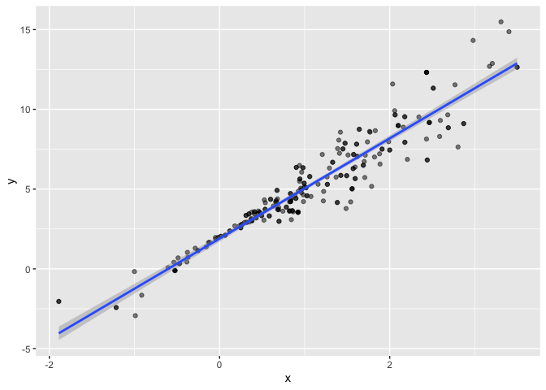

Bootstrapping
================
Jessica Lavery
11/14/2019

``` r
n_samp = 250

# simulated dataframe with constant variance
sim_df_const = 
  tibble(
    x = rnorm(n_samp, 1, 1),
    error = rnorm(n_samp, 0, 1),
    y = 2 + 3 * x + error
  )

# change so that variance is dependent on x (linear regression assumption of constant  variance doesn't hold)
# confidence interval for slope is completely wrong
sim_df_nonconst = sim_df_const %>% 
  mutate(
  error = error * .75 * x,
  y = 2 + 3 * x + error
)
```

``` r
sim_df = 
  bind_rows(const = sim_df_const, nonconst = sim_df_nonconst, .id = "data_source") 

sim_df %>% 
  ggplot(aes(x = x, y = y)) + 
  geom_point(alpha = .5) +
  stat_smooth(method = "lm") +
  facet_grid(~data_source) 
```

<!-- -->

# Fit linear models

``` r
# dataset with constant variane (lm assumptions hold)
lm(y ~ x, data = sim_df_const) %>% 
  broom::tidy() %>% 
  knitr::kable(digits = 3)
```

| term        | estimate | std.error | statistic | p.value |
| :---------- | -------: | --------: | --------: | ------: |
| (Intercept) |    1.977 |     0.098 |    20.157 |       0 |
| x           |    3.045 |     0.070 |    43.537 |       0 |

``` r
# datset with nonconstant variance
# should be more variance in this model than the model on the dataset with constant variance, results from model aren't really representative of what we would expect
lm(y ~ x, data = sim_df_nonconst) %>% 
  broom::tidy() %>% 
  knitr::kable(digits = 3)
```

| term        | estimate | std.error | statistic | p.value |
| :---------- | -------: | --------: | --------: | ------: |
| (Intercept) |    1.934 |     0.105 |    18.456 |       0 |
| x           |    3.112 |     0.075 |    41.661 |       0 |

# Bootstrap

``` r
# write code to sample before writing as a function
sim_df_nonconst %>% 
  sample_frac(replace = TRUE, size = 1) %>% 
  arrange(x)
```

    ## # A tibble: 250 x 3
    ##         x  error       y
    ##     <dbl>  <dbl>   <dbl>
    ##  1 -1.89   1.62  -2.04  
    ##  2 -1.29   1.40  -0.454 
    ##  3 -0.989 -1.97  -2.93  
    ##  4 -0.989 -1.97  -2.93  
    ##  5 -0.914 -0.908 -1.65  
    ##  6 -0.914 -0.908 -1.65  
    ##  7 -0.914 -0.908 -1.65  
    ##  8 -0.733  0.447  0.248 
    ##  9 -0.733  0.447  0.248 
    ## 10 -0.606 -0.106  0.0774
    ## # … with 240 more rows

``` r
# write a function to draw a bootstrap sample based on a dataframe
boot_sample = function(df) {
  sample_frac(df, replace = TRUE)
}

# make sure that this function works
boot_sample(sim_df_nonconst) %>% 
  ggplot(aes(x = x, y = y)) + 
  geom_point(alpha = .5) +
  stat_smooth(method = "lm")
```

<!-- -->

``` r
# run bootstrap sampling
boot_straps = tibble(
    strap_number = 1:1000,
    strap_sample = rerun(1000, boot_sample(sim_df_nonconst))
  )

# look at a few bootstrap samples
boot_straps %>% 
  filter(strap_number %in% 1:2) %>% 
  # sort by x within each sample
  mutate(strap_sample = map(strap_sample, ~arrange(.x, x))) %>% 
  # pulls out data frames
  pull(strap_sample)
```

    ## [[1]]
    ## # A tibble: 250 x 3
    ##         x  error       y
    ##     <dbl>  <dbl>   <dbl>
    ##  1 -1.29   1.40  -0.454 
    ##  2 -0.989 -1.97  -2.93  
    ##  3 -0.914 -0.908 -1.65  
    ##  4 -0.914 -0.908 -1.65  
    ##  5 -0.805  0.292 -0.123 
    ##  6 -0.805  0.292 -0.123 
    ##  7 -0.665 -0.544 -0.539 
    ##  8 -0.641 -0.416 -0.338 
    ##  9 -0.606 -0.106  0.0774
    ## 10 -0.606 -0.106  0.0774
    ## # … with 240 more rows
    ## 
    ## [[2]]
    ## # A tibble: 250 x 3
    ##         x  error      y
    ##     <dbl>  <dbl>  <dbl>
    ##  1 -1.89   1.62  -2.04 
    ##  2 -1.89   1.62  -2.04 
    ##  3 -1.29   1.40  -0.454
    ##  4 -1.29   1.40  -0.454
    ##  5 -1.00   0.832 -0.169
    ##  6 -0.914 -0.908 -1.65 
    ##  7 -0.805  0.292 -0.123
    ##  8 -0.665 -0.544 -0.539
    ##  9 -0.665 -0.544 -0.539
    ## 10 -0.665 -0.544 -0.539
    ## # … with 240 more rows
